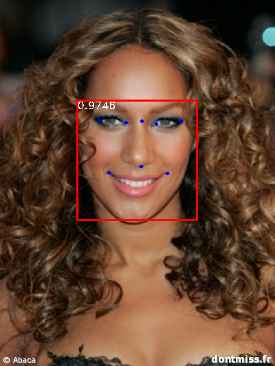
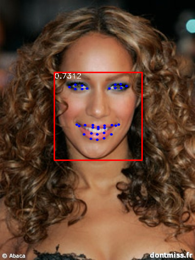
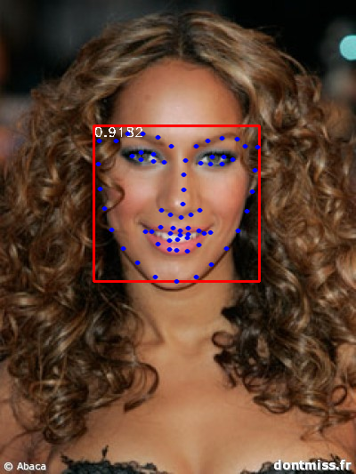

# RetinaFace in PyTorch

Pytorch RetinaFace for 68 landmarks. 

Support customized landmark num.

# Data
300w : 300W + helen + ibug + lfpw

choose the images only one face

# Training
train.sh

https://github.com/biubug6/Pytorch_Retinaface

# Testing
test.sh

https://github.com/biubug6/Pytorch_Retinaface

# Results

